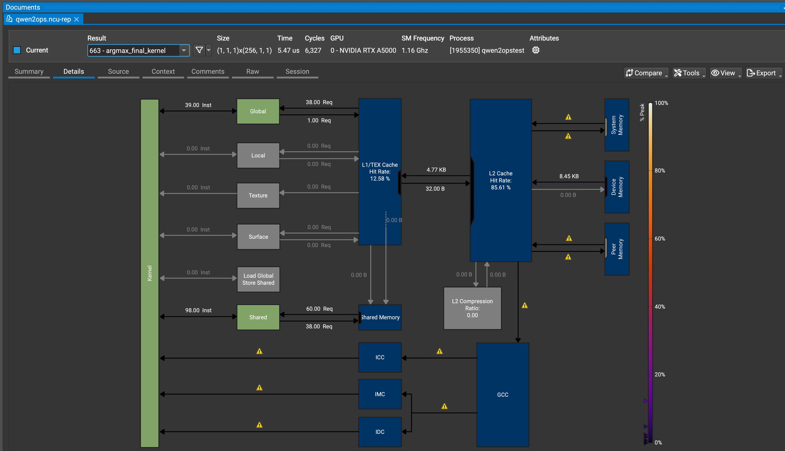
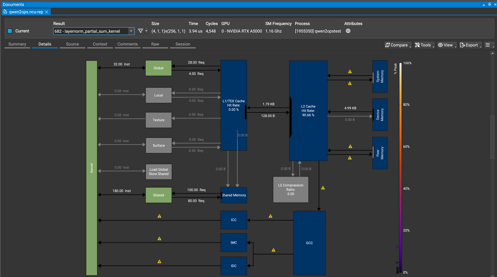
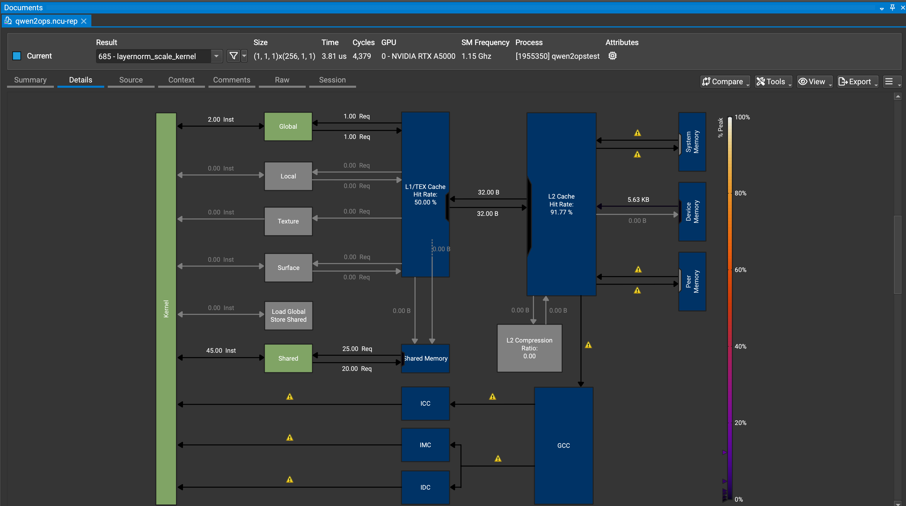
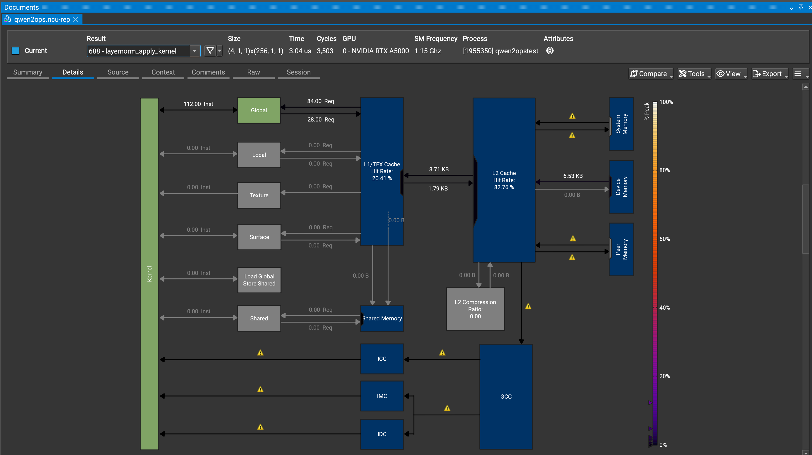
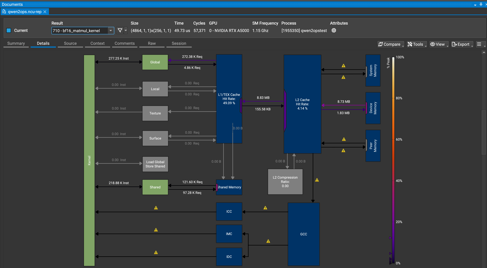
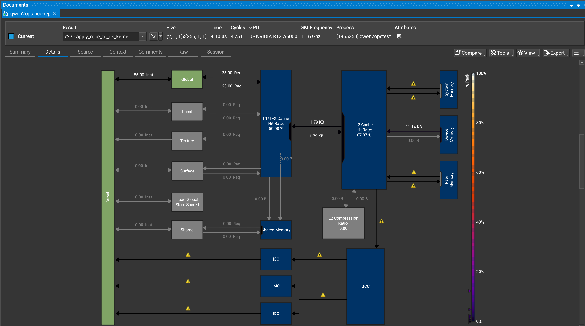
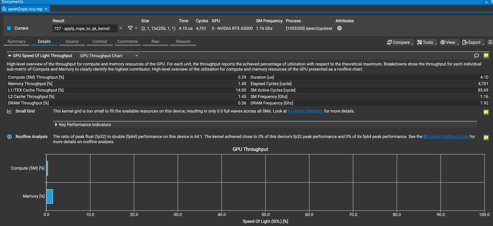
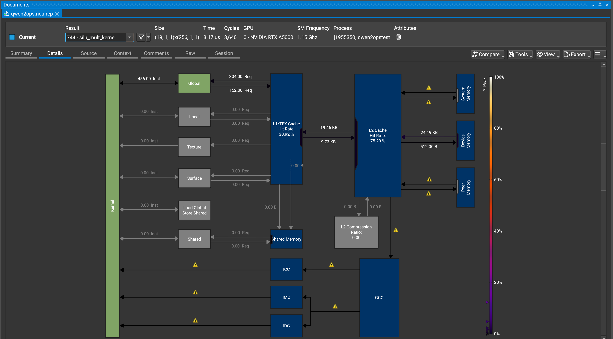
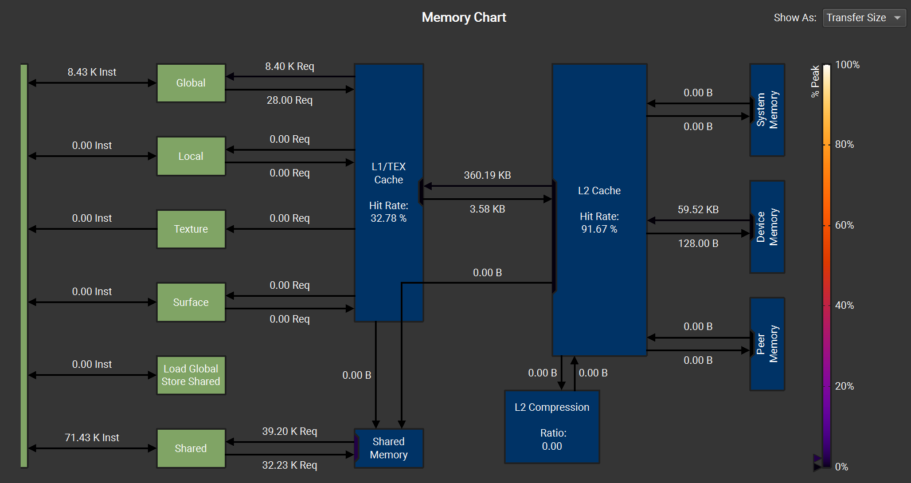

# transformer

Caltech CS179 Transformer Project

# Background

I recommend you read [Attention Is All You Need](https://arxiv.org/abs/1706.03762) many times, this paper is critical to all transformer models.

We will be implementing the [Qwen2](https://arxiv.org/pdf/2407.10671) model, an open-weights LLMs.
Qwen2's architecture is copied from [Meta's Llama](https://arxiv.org/abs/2407.21783), except Qwen2 uses bias in the QKV matrices.
Both of these architectures implement [grouped-query attention](https://arxiv.org/abs/2305.13245),
[layer normalization](https://arxiv.org/abs/1607.06450v1) with zero mean,
[SwiGLU feed forward networks](https://arxiv.org/abs/2002.05202), and
[rotary positional embeddings](https://arxiv.org/abs/2104.09864).

# Implementation

We will only implement autoregressive decoding, which supports inference (generation) with one token at a time.
With single-token decoding, we avoid the masked attention operator which is the focus of most transformer optimization such as [FlashAttention](https://arxiv.org/pdf/2205.14135).
Additionally, we will not support batching.

We will use the [`bfloat16`](https://en.wikipedia.org/wiki/Bfloat16_floating-point_format) data type to store
model weights and key/value cache to reduce memory bandwidth relative to `float32`. However,
internally, we will use `float32` for accumulation within kernels, to minimize unnecessary floating-point rounding errors.

For simplicity, all tensors in this implementation will use row-major ordering, i.e. the memory is contiguous along the last dimension.
However, this layout is not optimal for performance is all cases.

# Real world LLM inference

This project is missing many features in real-world production LLM inference, such as:
- Batching
- Prefill phase with masked matrix multiply
- Tensor cores
- Quantization
- Advanced model architectures, such as Mixture-of-Experts (MoE)
- Multi-GPU and multi-node parallelization
- KV cache offloading
- Sampling methods, such as Top-K

# Assignment
You will implement all kernels necessary for the LLM. Libraries are not allowed (such as cuBLAS, CUTLASS, cub, and thrust),
you must code all kernels from scratch.

## Part 1 (first week)

For the questions, cite sources you used. To submit, zip your repository to `~/lab5_2025_submission.zip`.

### Question 1.1 (5 points)
In this assignment, we will not be using tensor cores, because they require advanced data transfer layouts.
Instead, we will implement matrix-vector multiply with standard fused-multiply-add operators.
What is ratio of BF16 tensor core FLOPS to BF16 non-tensor core FLOPS on an A100-PCIE-40GB GPU?
Note: NVIDIA and AMD marketing both try to inflate their performance by measuring "sparse" tensor core operations, but nobody uses those.

#### Answer
The BF16 tensor core FLOPS seem to be 312 TFLOPS. The peak BF16 seems to be 39 TFLOPS. 312 / 39 = 8.

refs: 

[https://www.nvidia.com/content/dam/en-zz/Solutions/Data-Center/a100/pdf/nvidia-a100-datasheet-us-nvidia-1758950-r4-web.pdf](https://www.nvidia.com/content/dam/en-zz/Solutions/Data-Center/a100/pdf/nvidia-a100-datasheet-us-nvidia-1758950-r4-web.pdf)

[https://developer.nvidia.com/blog/nvidia-ampere-architecture-in-depth/](https://developer.nvidia.com/blog/nvidia-ampere-architecture-in-depth/)

### Question 1.2 (5 points)
What is the expected speedup of tensor cores vs non-tensor cores for matrix-vector multiplication on an A100-PCIE-40GB GPU?
Make an argument based on arithmetic intensity (FLOPS is not the whole story).
Assume the matrix and vector are read from off-chip memory.

#### Answer
Let the matrix shape be M x N.

For matrix-vector multiplication, each matrix element is read once and used for one multiply-add operation. So, the traffic from reading the matrix would be 2MN bytes.

Then, then, we'll assume that the vector is cached perfectly, so it only needs to be read from memory once. This will be 2N bytes read. Each value in the vector will be used in 2N FLOPs.

To do the actual computation, there will be 2MN FLOPs in the matrix-vector multiplication.

Then, the output writes 2M bytes.

The arithmetic complexity would be 2MN / (2MN + 2N + 2M). 2MN in the denominator dominates when M and N are large. This gives an approximate arithmetic intensity of 1. 

We know that the the A100 40GB can read at about 1555 GB/s (approx 1.6). So for the tensor cores, the arithmetic intensity would have to be at least 312 / 1.6 = 195 FLOP/byte to become compute-bound. The threshold is 39 / 1.6 = 24.375 FLOP/byte for non-tensor cores. Our 1 FLOP/byte intensity is far below both of these thresholds. 

Thus, there would be essentially no speedup between tensor and non-tensor cores a single matrix-vector multiplication.

ref: [https://www.nvidia.com/content/dam/en-zz/Solutions/Data-Center/a100/pdf/nvidia-a100-datasheet-us-nvidia-1758950-r4-web.pdf](https://www.nvidia.com/content/dam/en-zz/Solutions/Data-Center/a100/pdf/nvidia-a100-datasheet-us-nvidia-1758950-r4-web.pdf)


### Coding (80 points)
Implement GPU operators:
- ArgMax
- LayerNorm
- MatrixVectorMultiply
- RoPE
- SiLUMult

### Profiling (10 points)
Profile all your kernels with `ncu`, with input sizes matching what you'd expect for Qwen2 0.5B.
For each kernel, provide a screenshot and explain something interesting you noticed.
For example:
- Explain why your kernel is memory-bandwidth limited, latency/occupancy-limited, compute-limited, or limited by some other overhead.
- Explain why your kernel has suboptimal memory accesses, and a potential strategy to improve the kernel with expected performance increase.
- Explain which kernels are the most important to optimize, and which ones are less important.
- Explain how the performance would be different in another scenario (e.g. longer sequence length, larger model, increased batch size)
- Explain similarities across the kernels

#### Answers
I ran the following commands
```
cmake -S . -B build -DCMAKE_BUILD_TYPE=Release
cmake --build build --target qwen2opstest
./build/qwen2opstest
ncu --set full -f -o profiling/qwen2ops ./build/qwen2opstest
```

##### ArgMax

Something interesting is the read/write ratio for global memory. 300KB was read, while only 1KB was written. This ratio makes sense, because each thread in each block reads a value from memory, but only 1 thread per block writes the max value and corresponding index to global memory. There's also a decent amount of shared memory activity from the reduction steps.


This is the memory profile for argmax_final_kernel. The memory traffic is much lower than the partial kernel because the final kernel only reduces the partial results from the first stage. There are at most 1024 partial values and 1024 partial indices, so it reads only a few KB from global memory and writes a single final index. The chart shows about 8.45 KB of device-memory reads, compared to hundreds of KB in the partial kernel. Most of the remaining memory instructions are shared-memory accesses from the one-block tree reduction. Since this kernel launches only one block and works on a tiny input, its runtime is mostly overhead/latency rather than compute or bandwidth.

##### LayerNorm


This has a similar activity profile as the argmax partial memory kernel. This makes sense, as both kernels are calculating some single value of the block, storing it in shared memory, doing a reduction in shared memory, and saving a singular value to global memory for the entire block. This is characterized by lots of global reading, a decent amount of shared memory reading + writing, and very little global writing.


This kernel is extremely non-intensive, because it's doing a reduction only on an array of max length 1024. As you can see, the L2 cache rate is extremely high. Something interesting is that the L2 hit rate is extremely high. I suspect this is because partial sums was just written to memory by the previous kernel. And since there's a max of 1024 blocks, the entire partial sums array can it into the L2 cache easily.


This kernel is more global memory intensive compared to the previous two kernels, with no shared memory usage. This is expected, because it's reading the hidden state and weights and writing to output, all 3 of which are stored in global memory. The chart shows only global-memory instructions and no shared-memory instructions, matching the code. The dominant read/write ratio is about 2:1 because each element requires reading the hidden state and weight and writing the normalized output; the extra scale read is small compared to the full-vector traffic. Since the computation per element is only a few multiplies and a BF16 conversion, this kernel is more likely limited by memory traffic and launch overhead than by compute.

##### MatrixVectorMultiply

This kernel is the matrix vector multiplication. One thing I noticed is that the L1/TEX cache hit rate is higher than in several of the previous kernels. This is likely due to reuse of vec: every output row uses the same input vector, so blocks running on the same SM can reuse vector values from L1 cache. The other data loaded in from global memory is the matrix, but this is likely not stored in L1 cache (or if it is, it's not hit in the future) because each value in matrix is only used once. And as expected, there's some shared memory activity. This is expected, because the code assigns a block for each row, then does the reduction for the final value `out[i]`. Thus, the shared memory is needed for this implementation. The read/write ratio is also extremely high for the global memory. This is also expected, because the huge m x k matrix is read from memory, while only a (m, 1) matrix is written. 

##### RoPE

Here, all the memory usage is global, with no shared memory usage. This is expected, because some calculations are done, then the information does the modification in place. All the values for the rope operation can be derived from the given data that is already


This operation isn't compute or memory bound, just like many of the other kernels. It's not saturating either compute or memory bandwidth. The "Small Grid" warning indicates that the kernel launches too few blocks to fill the gpu. So, this kernel's runtime is mainly dominated by kernel overhead and latency rather than arithmetic throughput or memory bandwidth. But the "Small Grid" warning should be expected and isn't necessarily bad, because the amount of data being read/written from memory and the compuations themselves aren't super intensive. So the largest issue is likely due to kernel launch latency rather than compute or memory bandwidth.


##### SiLUMult

First, there's no shared memory used. This is expected, because it's simply reading x[i] and y[i] from memory, then writing back to x. At the code level, SiLUMult reads two BF16 vectors and writes one BF16 vector, so the expected logical read/write ratio is 2:1. Nsight’s L1/L2 traffic matches this: about 19.46 KB read and 9.73 KB written. The much larger device-memory read/write ratio is because device-memory counters measure actual DRAM transactions after caching; most stores are absorbed in L2/write-back cache and are not flushed to DRAM during the profiled kernel.

## Part 2 (second week)

To submit, zip your repository to `~/lab6_2025_submission.zip`.

### Question 2.1 (3 points)
List all the matrix-vector multiplies in a Qwen2 0.5B layer, including the (M, K) dimensions of the matrix.
(Do not include grouped-query attention).

#### Answer
q_proj_weight @ attn_input       (896, 896)
k_proj_weight @ attn_input       (128, 896)
v_proj_weight @ attn_input       (128, 896)
o_proj_weight @ weighted_values  (896, 896)
gate_proj_weight @ ffn_input     (4864, 896)
up_proj_weight @ ffn_input       (4864, 896)
down_proj_weight @ ffn_hidden    (896, 4864)

### Question 2.2 (2 points)
Treating each query head as a row of a matrix, what are the dimensions of the matrix-matrix multiply in a
Qwen2 0.5B layer grouped-query attention operation? Assume current sequence length is 1234 tokens.

#### Answer
This answer includes the value multiplication, because the original "Attention is All You Need" paper defines attention as the entire QKV operation, rather than just calculating the attention scores from Q @ K^T.

num_query_heads = 14
num_kv_heads = 2
head_size = 64
seq_len = 1234

7 query heads, each of length 64
(7, 64)

The key values from 1234 tokens:
(1234, 64)

The value values from 1234 tokens:
(1234, 64)

Q_group @ K_cache_for_one_kv_head.T @ V_cache_for_one_kv_head
((7, 64) x (64, 1234)) x (1234, 64) = (7, 1234) x (1234, 64) = (7, 64)
^ 2 of these, since there are 14 query heads and 2 key/value heads. each of the above operation takes care of 7 query heads and 1 KV head.

This solution ignores the softmax operation. This fine, because that's not a matrix multiply.

### Question 2.3 (5 points)
Assuming off-chip memory bandwidth is the limiting factor, what is the theoretical minimum inference latency (in ms)
for Qwen2 0.5B on an A100-PCIE-40GB, with BF16 weights? Assume small sequence length (i.e. KV cache size is negligible).

#### Answer
Since the problem assumes that off-chip memory bandwidth is the limiting factor, we will not consider computation time. We'll also assume that the model weights are already in GPU global memory.

Qwen2 0.5B has about 0.5B parameters. Each parameter is BF16, so 2 bytes. Total bytes that need to be read is 500,000,000 * 2 = 1,000,000,000 bytes (1e9). The A100-PCIE-40GB can read at 1555 GB/s (1.555e12 B/s). Thus, 1e9 / 1.555e12 = 6.4e-4 = 0.64 ms.

### Question 2.4 (5 points)
Determine the sequence length at which the KV cache becomes non-negligible in terms of performance;
specifically, at what sequence length in Qwen2 0.5B would the KV cache become 10% the size of the model parameters?

#### Answer

Size of KV cache = 2 * number_of_heads * head_dim * precision * num_layers * seq_len
= 2 * 2 * 64 * 2 bytes * 24 * T
= 12288 * T

10% of parameter size = 0.1 * 0.5B * 2 bytes = 100M

100,000,000 <= 12288 * T
T >= 8138 tokens

At 8138, the KV cahce becomes 10% the size of the model parameters

### Coding (75 points)
Complete:
- GroupQueryAttention
  - Must use online numerically stable softmax, see section 3.1 of [Online normalizer calculation for softmax](https://arxiv.org/pdf/1805.02867)
- Qwen2Layer
- Qwen2Model

You should not allocate or free any memory inside `Qwen2Model::forward`;
scratch space should be allocated only at model initialization, in constructors.

Test by running `./transformer`, and 100 tokens will be produced, matching the python reference implementation 

Once working, you can run `./transformer --interactive --max-seq-len 10000` to send messages with a chatbot interface.

### Profiling (10 points)

Once working, profile your implementation with:
```bash
ncu --set full --nvtx --nvtx-include last_token/ -c100 -o profile ./transformer
```
(may adjust -c parameter to number of kernels per layer)

How many microseconds per layer does your implementation take?
What is the slowest part of the layer and why?
Include screenshots of the something interesting you notice, and explain.

#### Answer
- layernorm_partial_sum_kernel: 3.84 useconds
- layernorm_scale_kernel: 3.84 useconds
- layernorm_apply_kernel: 3.10 useconds
- bf16_matmul_kernel: 13.95 useconds
- bf16_matmul_kernel: 6.5 useconds
- bf16_matmul_kernel: 6.27 useconds
- apply_rope_to_qk_kernel: 4.13 useconds
- apply_rope_to_qk_kernel: 3.94 useconds
- group_query_attention_kernel: 187.97 useconds
- bf16_matmul_kernel: 13.54 useconds
- bf16_add_in_place_kernel: 3.07 useconds
- layernorm_partial_sum_kernel: 3.94 useconds
- layernorm_scale_kernel: 3.78 useconds
- layernorm_apply_kernel: 3.14 useconds
- bf16_matmul_kernel: 50.30 useconds
- bf16_matmul_kernel: 50.53 useconds
- silu_mult_kernel: 3.26 useconds
- bf16_matmul_kernel: 34.72 useconds
- bf16_add_in_place_kernel: 3.07 useconds
- layernorm_partial_sum_kernel: 3.94 useconds
= 406.83 microseconds

The slowest part was the group query attention kernel. This is expected, because this is the largest operation and consists of many dot product calculations to find the attention table. I also think that it can be further parallelized. For example, each the threads loop through the entire sequence. So, the token sequence could be split into sections to be further parallelized, with some type of reduction done on the chunks of the input.


Something interesting is that GroupQueryAttention has much more shared-memory activity than global-memory activity. This comes from the per-token dot-product reduction using partials[256]: for every token, the block stores products in shared memory and repeatedly reduces them with synchronization. Since Qwen2 0.5B has head size 64 but the kernel launches 256 threads, many threads participate mostly in reduction overhead. The L1 hit rate is only about 33%, but the L2 hit rate is high at about 92%, which makes sense because grouped-query attention reuses the same K/V cache entries across several query heads. A possible optimization would be to use fewer threads or warp-level reductions to reduce shared-memory traffic and synchronization overhead.


## Assignment notes

- Your kernels must fully occupy the GPU when possible (i.e. do not launch with only 1 block, launch with many).
- Kernels should have optimal memory access (coalesced gmem, and no smem bank conflicts) when possible.
- Always use CUDA streams when launching kernels, such as:
  - `my_kernel<<<grid_dim, block_dim, 0, stream>>>(my_arg);`
- Use the test cases and python reference to check the correctness of your implementation.

## Debugging tips

- Add print statements in the python implementation and equivalents in the CUDA implementation, such as:
```python
print('after q proj:', queries[0, 0])
```
corresponding to
```c++
std::cerr << "after q proj: " << static_cast<float>(*static_cast<__nv_bfloat16*>(queries->data)) << std::endl;
```
and check when they diverge.

- All GPU memory is allocated with `cudaMallocManaged`, which allows you to access the GPU memory from the CPU.
  Therefore, with plain GDB, we can run:
  - `CUDA_LAUNCH_BLOCKING=1 gdb ./transformer`
  - Set breakpoints
  - Save a tensor to disk: `dump binary memory /tmp/queries.bin queries->data ((uint8_t*)queries->data)+queries->size`
  - Load the tensor in python: `torch.from_file('/tmp/queries.bin',size=head_size*num_query_heads,dtype=torch.bfloat16).reshape(num_query_heads, head_size)`

## Test cases
Run all test cases with:
- `cd build`
- `cmake --build .`
- `ctest`

For tests that are failing, you can run them individually to see which elements were incorrect, for example:
- `cd build`
- `cmake --build .`
- `./silumulttest`

Failing output:
```
difference at index 0: GPU calculated 10.875, CPU calculated 108.5
difference at index 1: GPU calculated -5.65625, CPU calculated 0.332031
difference at index 2: GPU calculated 7.3125, CPU calculated -76.5
...
```

Also, note that passing all test cases does not mean you will get an A.
The test cases only check for correctness, not for performance.
If your kernels have needless suboptimal memory access, poor occupancy, or other performance issues,
the tests will still pass, but you will not get a good grade.

## Author
Sam Foxman 2025
